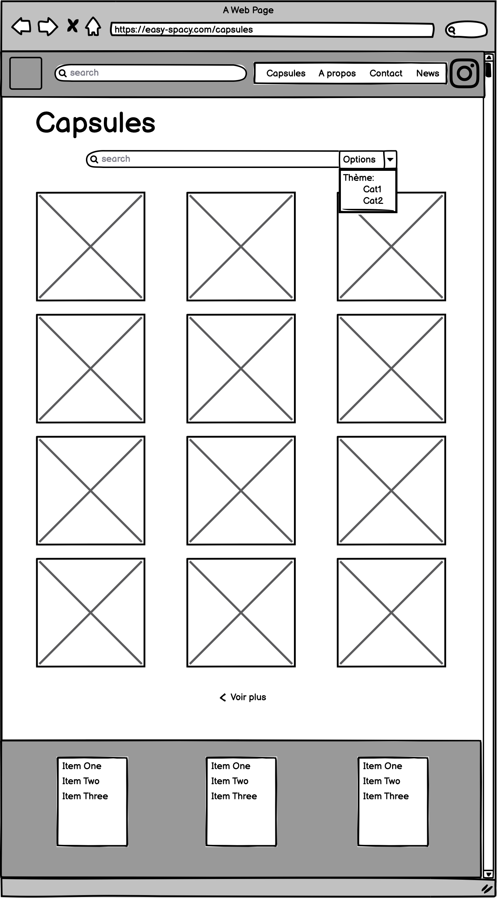

# Easy-Spacy

> Ce projet à été créé dans le cadre scolaire pour la HEPL.

---
## Sommaire

1. Stratégie

2. Plan du site

3. Prise de note

---
## Stratégie

### Besoins du client

* Accueil
	
	Sur cette page, il y aura une en-tête avec les différentes pages ainsi q'une barre de recherche qui permettra de chercher des articles, ou des news dans tout le site.

	Ensuite il y aura une section de mini-explication du fonctionnement du site, avec les deux avatares.

	Pour finir, il aura les capsules par ordre de préférence (ou de date?). les capsules sur cette page seront sous forme de preview qui ménerons vers une page dédiée par capsule.

* News

	Sur cette page,

* A propos

	Sur cette page, il y aura une brève description du parcours des deux clients et de la création de Easy spacy. Les avatares doivent avoir une place importante dans cette pâge.

	Cette page contiendra également pleins de rensignements plus généraux sur les deux clients.

* Contact

	Cette page servira aux visiteurs de contacter les créateurs, afin de proposer, par exemple, des idées de sujet, des questions,...

	La partie contact sera composée de plusieurs champs: nom et prénom, adresse mail (pour envoyer un mail de comfirmation d'envois du messge, ou offrir la possibilité aux clients de répondre), message, et pour finir d'un bouton "envoyer".

* Suivez-nous

	Sur cette page, tous les réseaux socieau de Easy spacy seront référencés.

* Page pour la presse

	Sur cette page,

## Plan de site

### Accueil

- En-tête (header)

	Une barre de menu, avec les différents sous-menus et avec une barre de recherche.
	Dans cette barre mettre a coté de l'onglet contact vers le profil instagram d'Easy-Spacy.
	Un bouton (CTA) vers toutes les capsules
	Un bouton (CTA) vers la présentation des fondateurs d'Easy Spacy.

-  Contenu de la page (Body)

	Une section de présentation du projet avec le rappel des avatares. Sur cette section, il y aura la précense des deux avatares avec un texte de plus ou moins 5 lignes qui présentera ce que fait Easy Spacy, et le but du site. Cette section sera mise en avant avec une couleur de fond différente du reste de la page.

	Une seconde section qui montres les dernières capsules. Ici, sera disposée en mosaïque les prévisualisations les dernières capsules (mosaïque qui rappelera un profil instagram). Chaque préview sera cliquable et mènera vers la pages de la capsule dédiées.
Un bouton qui renverra vers la page de toutes les capsules.

- Pieds de page (footer)

	Lien vers les réseaux sociaux.
	Adresse mail.
	Redirection vers la page presse.
	Lien vers les mentions lègal.

### Page capsules

- 	En-tête: idem accueil
- 	Contenu de la page

	Cette page reprendra même mosaïque que la page accueil mais avec toutes les capsules sur cette page il sera également de rechercher une capsules en particulier ainsi que de les trier par type, ou sujet. Pour ce faire il y aura une barre de recherche ainsi que des options d'affinage.

- Pieds de page: idem accueil

### Page capsule X

- En-tête: idem accueil

- Contenu de la page

	Cette page contiendra qu'un seul capsule qui sera mise en quinconce, cad que la première image sera mise par exemple a droite avec son texte explicatif a gauche mais que la seconde sera avec son image à gauche avec son texte explicatif à droite.

	Au dessus de cette capsule, il y aura un petit texte explicatif de cette dernière.

- Pieds de page: idem accueil

### A propos de nous
- En-tête: idem accueil

- Contenu de la page

	Cette page contiendra deux textes explicatifs, un pour chaque créateur.

	Sur cette page j'aimerai rappeler les avatares? En effet, chaques personnages expliquera son parcours, ...

- Pieds de page: idem accueil
### News
- En-tête: idem accueil

- Contenu de la page

	Cette page, il y aura à gauche un texte explicatif du fonctionnement du contact, expliqué par un avatar. A droite de cette page, il y aura un formulaire de contact qui comprendra plusieurs champs: Nom et prénom de la personne, adresse mail de la personne, l'objet du message, le message et un bouton envoyer.

	En dessous de cette première section il y aura un rappel des réseaux sociaux d'Easy Spacy

- 	Pieds de page: idem accueil

## Wireframe

| Accueil  | A propos   | Capsules  |
|:----------|:----------|:----------|
||     |     |
| Capsule X | Contact   | 	         |
|    |     |           |

## Prise de note

Easy Spacy

Les postes se présentent sous forme de "petites capsules" (+- 8 slides).

ils ont des avatares personnalisé pour créer une interraction

### Ce qui doit avoir sur le site

* Logo
* La fusée
* Barre de recherche avec filtrage!!
* Onglets
    * Capsule
      *Tout le contenu
    * News
        * Actualité du site (blog)
    * A propos de nous
        * Présentations des personnes
    * Contact
        * Permet d'intéragire avec les visitieurs (easyspacy2327@gmail.com)
    * Suivez-nous
        * insta: @easyspacy
* Page pour la presse (Dans le pied page)

### Public cible

De base le public cicble de base est assez large, mais après plusieurs demande de personne ils aimerait rendre accéssibles les news aux personnes plus agées. Le but principale du site c'est <b>l'ACCESSIBILITE</b>.

Les personnes visées sur le site sont les personnes sans instagram.

### Divers

* Environnement dynamique (qqes animations)
* Le site doit être simple
* Accessibilité sur les téléphone
* Pas de site "kitch"

### Question/Réponse

1. Pour les capsules voulez-vous que les gens puissent laisser un commentaire?
    * Ce serait sympa de pouvoir intéragir sur les capsules en commentaire et puis que le visiteur puisse envoyer un message pour proposer un thème ou autre.

2. Dans le site doit on rappelé les avatares? (Eléments graphique?, background)
    * Dans la page d'accueil pt une bannière avec les deux avatares mais dans le reste de la page rester plus sombre, avec un fond clair.
    * Mais dans ce qui est pieds de page, etc on peut les utilisés.

3. Travaillez vous avec un graphiste?
    * Non les clients travaillent sur Canvas

4. Les postes doivent etre séparé dans des catégories ou pas du tout?
    * On peut y penser mais c'est pas obligatoir vu que sur instagram c'est pas le cas donc si il y en a une ça ne doit pas vraiment etre trop flagrant.

5. Etant donné que vous partiez d'instagram, les contenus doivent être adaptés au site.
    * Pt mettre un lien sur le poste vers instagram et vive versa.
    * On pourrait peut etre voir le site comme qqch de plus complet que sur instagram

6. Avez vous pensez a un système de like sur le site?
    * On peut le faire mais les clients n'y avaient pas pensés de base.

7. Au niveau référencement du site, pt avoir une partie qui donne acces a la presse?
    * Travailler sur la présentation au niveau des méta données pour que les postes soit bien adaptables. Des outils de partages, une page dédiée pour la presse.
    * Le concept a pour but d'évoluer, pt faire une BD, etc.

8. La page d'accueil doit montrer directement les capsules?
    * De base non mais si le public cible est plus axés sur les personnes agées, ce serait pt bien de mettre quelques capsule pour pas que le visiteur doit trop cherché. Vu que le but principal du site c'est l'es capsules donc il est important de les mettre en pages d'accueil.

9. Dans la barre de recherche doit on mettre les news et les capsules ensemblent?
    * Dans la barre de recherche on sible principalement les capsules.

10. Une page dédiée par poste (niews et capsules)
    * Ce serait bien de faire un preview

11. Au niveau de l'adresse mail?
    * Le site va être sur un domaine donc vous pourriez utilisé l'adresse contact@easyspacy.com par exemple.

12. Au niveau format des capsules? Voulez garder le "slide"?
    * Idéalement ce serait bien, il y aura une partie textuel en dessous ou alors <b>il y aura une légende global pour le poste</b>.

